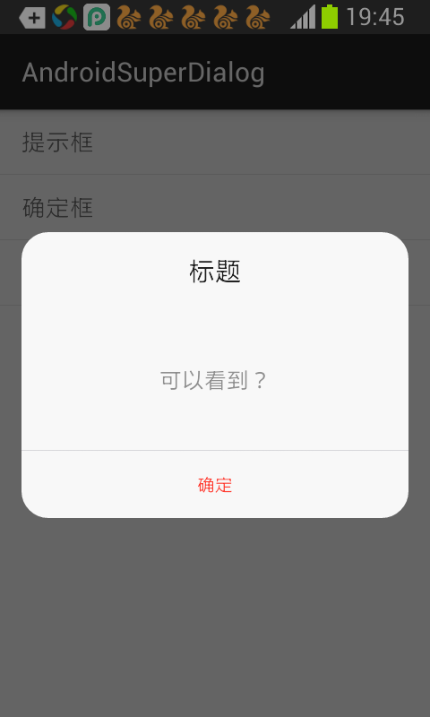
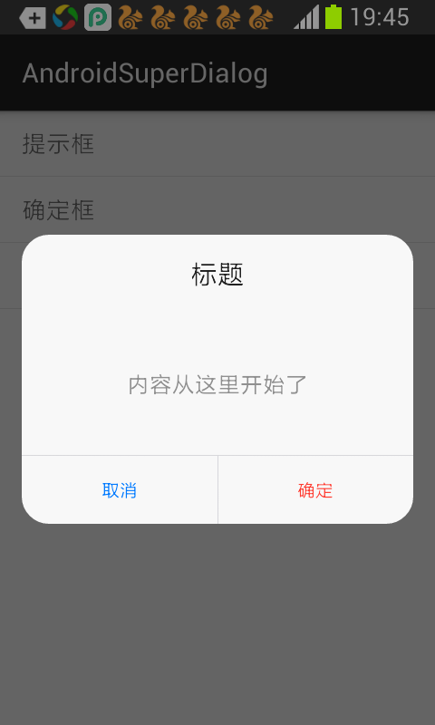
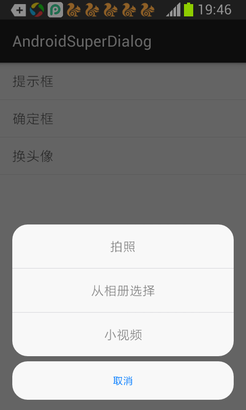

# AndroidSuperDialog
   基于 DialogFragment 封装，支持自定义边框圆角、背景透明度、字体大小与色值等。
   详细见demo

#效果图

# 引入
 compile 'com.mylhyl:superDialog:1.0.1'
#使用
    简单的对话框
                new SuperDialog.Builder(this).setRadius(10)
                        .setAlpha(0.5f)
                        .setTitle("标题").setMessage("可以看到？")
                        .setPositiveButton("确定", new SuperDialog.OnClickPositiveListener() {
                            @Override
                            public void onClick(View v) {
                                Toast.makeText(v.getContext(), "点了确定", Toast.LENGTH_LONG).show();
                            }
                        }).build();
    选择对话框
                final String[] strings = {"拍照", "从相册选择", "小视频"};
                new SuperDialog.Builder(this)
                        //.setAlpha(0.5f)
                        //.setGravity(Gravity.CENTER)
                        //.setTitle("上传头像", ColorRes.negativeButton)
                        .setCanceledOnTouchOutside(false)
                        .setItems(strings, new SuperDialog.OnItemClickListener() {
                            @Override
                            public void onItemClick(int position) {
                                Toast.makeText(MainActivity.this, strings[position], Toast.LENGTH_LONG).show();
                            }
                        })
                        .setNegativeButton("取消", null)
                        .build();
#说明
	此库自动将px转换百分比，由于 Dialog 布局一般只有微调，暂时只支持
	* textSize，height，padding。
	默认字体大小;Title、message、button、padding 的px在设计稿为 1080 * 1920 的尺寸
	所以使用时设计稿尺寸一定是1080 * 1920
#感谢
[AutoLayout-Android](https://github.com/DTHeaven/AutoLayout-Android)
